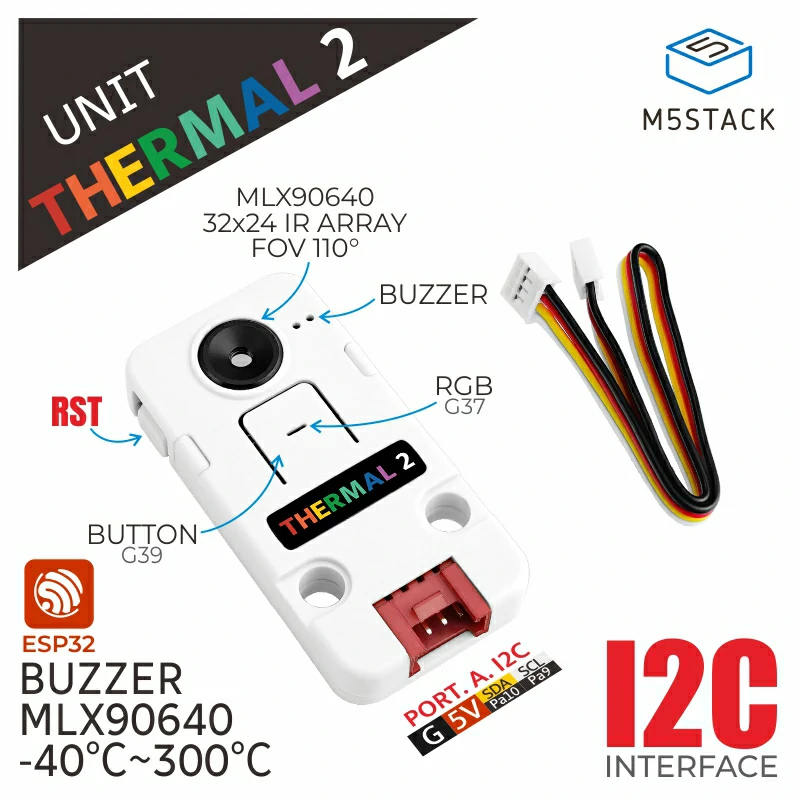

# Needed libraries and boards
needs the m5core2 library

board:
https://static-cdn.m5stack.com/resource/arduino/package_m5stack_index.json

if your having troubles with connecting to Arduino please go to this link:
https://docs.m5stack.com/en/arduino/arduino_ide
# Code
The code is in examples>factory test

# Desc
my version for the m5fire thermal camera code includes a crosshair which when pointed to reads the temperature
please be advised this is very scuffed as it was for a school project

# M5Unit-Thermal2-Internal-FW

## Documents

[Link](https://docs.m5stack.com/en/unit/UNIT%20Thermal2)

## I2C Protocol

[Link](./docs/M5UnitThermal2-I2C-Protocol.pdf)

## Library

[Link](https://github.com/m5stack/M5Unit-Thermal2)
